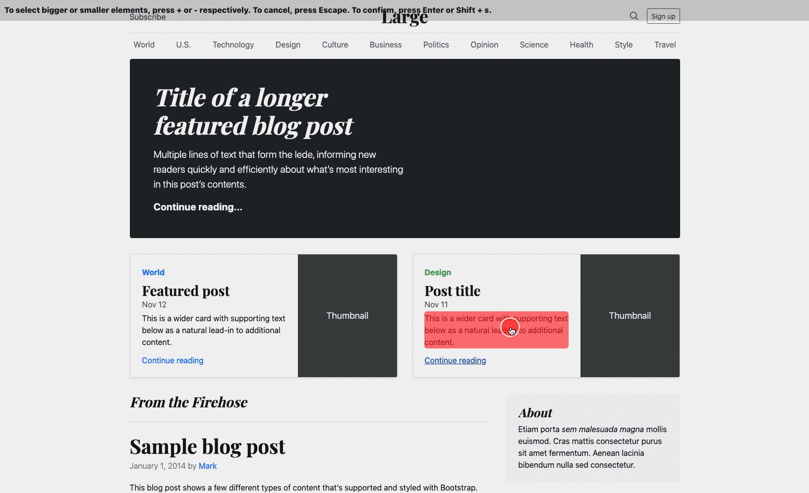

# Pick HTML Element

 

<!-- FIXME: show a gif of how the script work on a website -->

Generates an interface for picking HTML elements on any website using mouse and keyboard inputs. The interface sends out an event when an element is picked so that another script can pick up the collected information and act upon it.

To test the script on an example website, open `example/index.html` in Google Chrome.



## How to use

### Include `dist/index.js` in the website

```html
<script src="{{path to script}}"></script>
```

Alternatively, copy `dist/index.js` using `copy-webpack-plugin` in Webpack:

```javascript
new CopyPlugin({
  patterns: [
    {
      from: 'node_modules/pick-html-element/dist/index.js',
      to: 'pick-html-element.js'
    }
  ]
})
```

The latter solution may be useful for bundling Chrome extensions or proxying the script through a server.

### Show the selection interface to the user

```html
<script>
  window.pickHtmlElementScript.init()
</script>
```

### Listen for the select event

```html
<script>
  const listener = (event) => {
    console.log('User selected an HTML element. Details: ', event.detail)
    // Remove the interface for selecting an element or keep listening for more elements.
    window.pickHtmlElementScript.destroy()
  }

  window.addEventListener('pickHtmlElementScriptElementSelect', listener)
</script>
```

## Development

```shell
npm install
npm run-script build:watch
```

## Production

```shell
npm install
npm run-script build:production
```

## Testing

```shell
npm run-script test
```

## Docker

It's possible to run the development and production commands above inside a Docker container already configured with the right tools. To do so, use a prefix `./bin/exec` before each command. For example, `./bin/exec npm run-script build:watch`.

## Maintenance

The project uses ESLint and Prettier for maintaining a consistent code style across source files. Usually, these tools are picked up by the text editor and used automatically to validate and format code. They can be started manually using NPM commands specified inside package.json in the `scripts` section.
